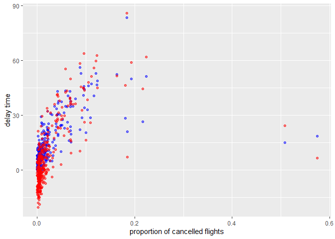

README.RMD
================
Huailin Tang
9/28/2021

## Question 1

``` r
library(dplyr)
library(nycflights13)
library(ggplot2)

sum(is.na(flights$dep_time))
```

    ## [1] 8255

``` r
print(head((flights[is.na(flights$dep_time),])))
```

    ## # A tibble: 6 x 19
    ##    year month   day dep_time sched_dep_time dep_delay arr_time sched_arr_time
    ##   <int> <int> <int>    <int>          <int>     <dbl>    <int>          <int>
    ## 1  2013     1     1       NA           1630        NA       NA           1815
    ## 2  2013     1     1       NA           1935        NA       NA           2240
    ## 3  2013     1     1       NA           1500        NA       NA           1825
    ## 4  2013     1     1       NA            600        NA       NA            901
    ## 5  2013     1     2       NA           1540        NA       NA           1747
    ## 6  2013     1     2       NA           1620        NA       NA           1746
    ## # ... with 11 more variables: arr_delay <dbl>, carrier <chr>, flight <int>,
    ## #   tailnum <chr>, origin <chr>, dest <chr>, air_time <dbl>, distance <dbl>,
    ## #   hour <dbl>, minute <dbl>, time_hour <dttm>

In flights which have NA in dep\_time, dep\_delay, arr\_time,
arr\_delay, air\_time are also missing. The story might be these flights
are cancelled.

## Question 2

``` r
head(mutate(flights,
       dep_time = (dep_time %/% 100) * 60 + (dep_time %% 100),
       sched_dep_time = (sched_dep_time %/% 100) * 60 + (sched_dep_time %% 100)))
```

    ## # A tibble: 6 x 19
    ##    year month   day dep_time sched_dep_time dep_delay arr_time sched_arr_time
    ##   <int> <int> <int>    <dbl>          <dbl>     <dbl>    <int>          <int>
    ## 1  2013     1     1      317            315         2      830            819
    ## 2  2013     1     1      333            329         4      850            830
    ## 3  2013     1     1      342            340         2      923            850
    ## 4  2013     1     1      344            345        -1     1004           1022
    ## 5  2013     1     1      354            360        -6      812            837
    ## 6  2013     1     1      354            358        -4      740            728
    ## # ... with 11 more variables: arr_delay <dbl>, carrier <chr>, flight <int>,
    ## #   tailnum <chr>, origin <chr>, dest <chr>, air_time <dbl>, distance <dbl>,
    ## #   hour <dbl>, minute <dbl>, time_hour <dttm>

## Question 3

``` r
library(lubridate)
flights %>%
  mutate(dep_date = lubridate::make_datetime(year, month, day)) %>% group_by(dep_date) %>%
    summarise(cancelled = sum(is.na(dep_delay)), n = n(),
            mean_dep_delay = mean(dep_delay,na.rm=TRUE),
            mean_arr_delay = mean(arr_delay,na.rm=TRUE)) %>%
      ggplot(aes(x= cancelled/n)) + 
      geom_point(aes(y=mean_dep_delay), colour='blue', alpha=0.5) + geom_point(aes(y=mean_arr_delay), colour='red', alpha=0.5) + 
      xlab("proportion of cancelled flights") + ylab("delay time")
```

<!-- --> Generally
there is no obvious relationship between proportion of cancelled flights
and delay time.
